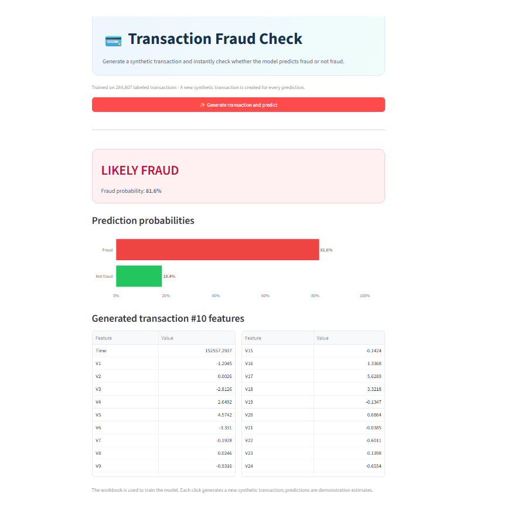

# Credit Card Fraud Detection

A machine learning project that explores credit card transactions and predicts whether a generated transaction is likely fraudulent. It includes a Jupyter notebook for data analysis and model experiments, plus a simple Streamlit frontend.

## Overview

The labeled transaction dataset is used to train the model. In the frontend, one click on **Generate transaction and predict** creates a fresh synthetic transaction and scores it. The app displays the predicted result, fraud and not-fraud probabilities, and the feature values used for that prediction.

Predictions are model estimates for demonstration. They are not confirmed fraud findings or real payment decisions.

## Features

- Explore the dataset and model experiments in the notebook.
- Train from labeled transaction data (`Class`: `0` = normal, `1` = fraud).
- Generate a synthetic transaction and predict its class in the frontend.
- View the prediction probability graph and generated feature values.
- Use notebook model artifacts when present, or train the app's balanced Random Forest on startup.

## Tech Stack

- Python
- Pandas and NumPy
- Scikit-learn
- Streamlit
- Plotly
- Jupyter Notebook

## Screenshots

### Fraud prediction



## Project Structure

```text
CreditCardFraudDetection/
├── app.py                    # Streamlit frontend and prediction flow
├── creditcard_project.ipynb  # Data analysis and model experiments
├── requirements.txt          # Python dependencies
├── README.md                 # Project documentation
├── screenshots/
│   └── fraud-prediction.png  # Streamlit frontend screenshot
└── .gitignore                # Excludes local data and generated files
```

## Getting Started

### Requirements

- Python 3.10 or newer
- The labeled transaction dataset, obtained separately

The local `creditcard.xls` file is actually CSV-formatted and is about 150 MB. It is excluded from Git because GitHub blocks regular Git files larger than 100 MiB. The app accepts either `creditcard.csv` or the existing `creditcard.xls` name; the notebook expects `creditcard.csv`. Put the dataset beside the app and notebook before running them. Only redistribute the dataset if its source license allows it.

### Install

Open PowerShell in the project folder and run:

```powershell
python -m venv .venv
.venv\Scripts\Activate.ps1
python -m pip install --upgrade pip
python -m pip install -r requirements.txt
```

### Run the frontend

```powershell
python -m streamlit run app.py
```

Open the local address printed by Streamlit. On first launch, the app reads the dataset and prepares the model. Streamlit caches the model for later reruns.

### Run the notebook

Open `creditcard_project.ipynb` in Jupyter or VS Code and run its cells. Make sure `creditcard.csv` is available beside the notebook first.

## Model Inputs

The model uses 30 numeric features: `Time`, `V1` through `V28`, and `Amount`. `Class` is the training target and is not passed to the model when predicting a synthetic transaction.

